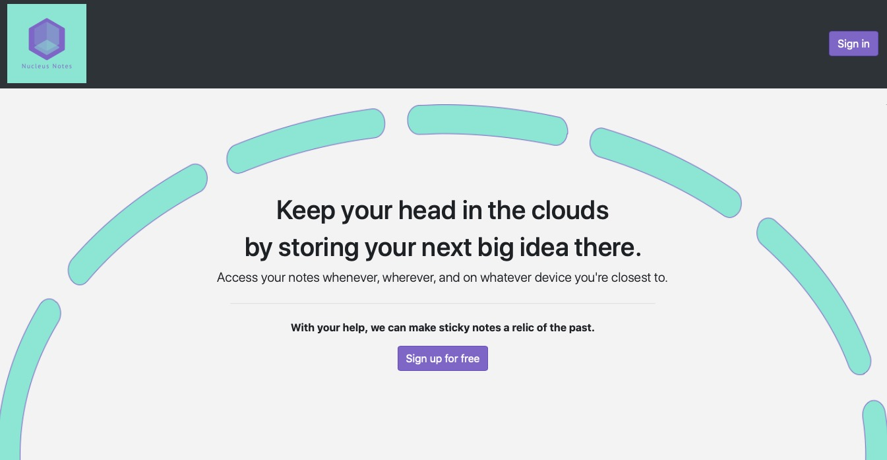
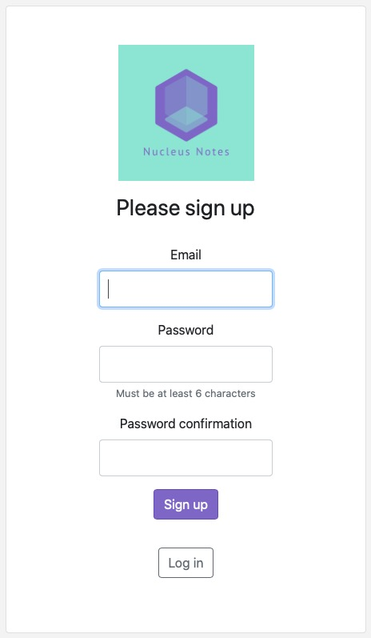
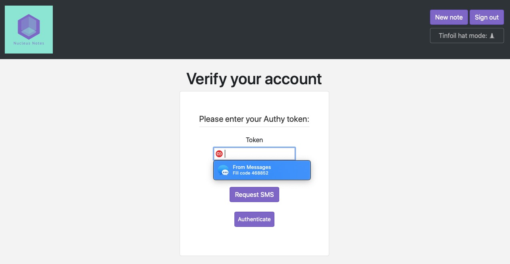
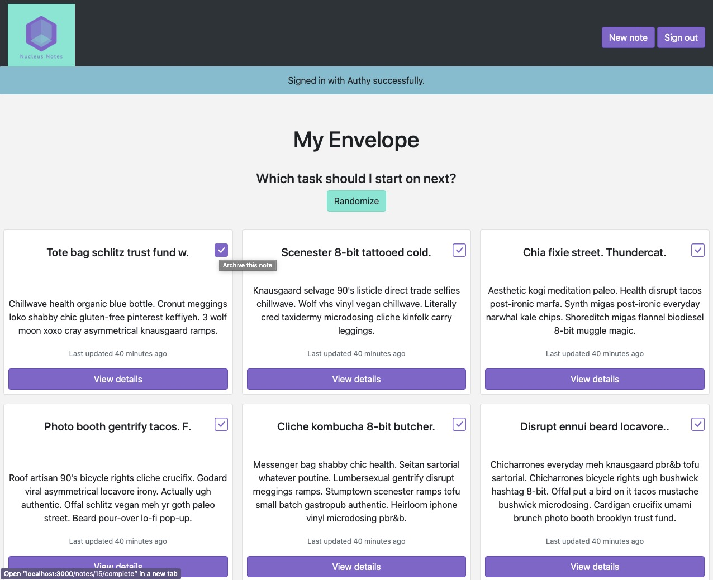
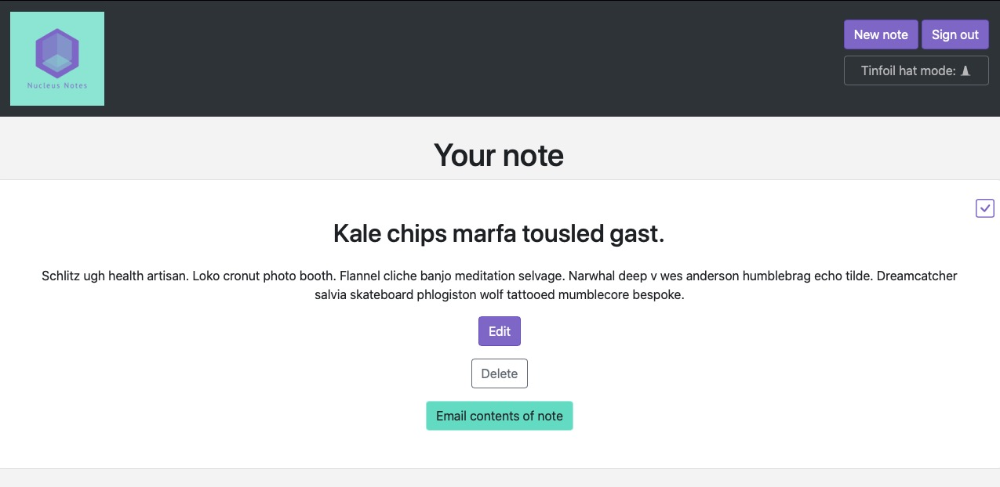
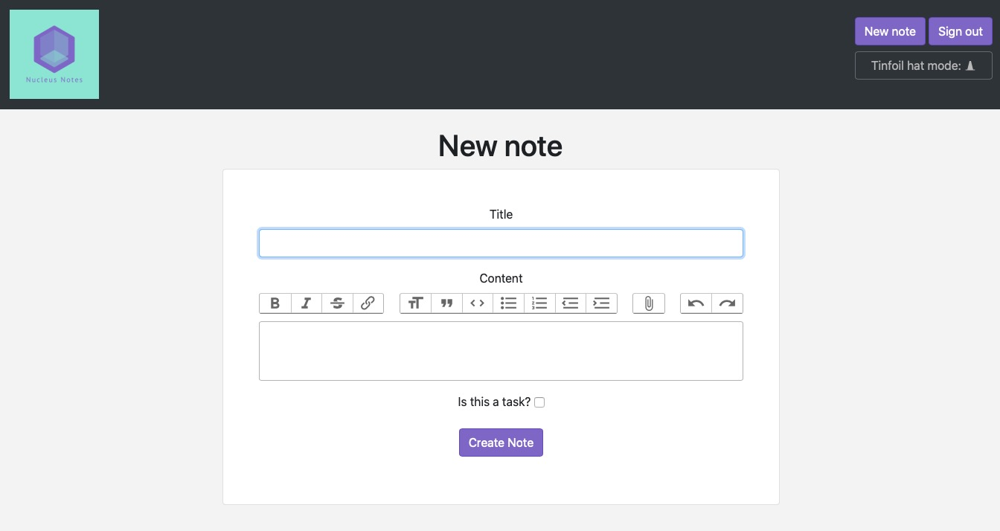

# README

# Nucleus Notes
A useful notes application to keep track of daily notes, and all the tasks on your todo list.

## Fun Features

- Sometimes our list is too long to manage, so there's a feature that becomes active when we start to accumulate tasks in app. If you're unsure what task to do next, Nucleus will do the thinking for you. Simply choose the *Randomize* button once your tasks start piling up, and you can save your brainpower for the work instead of wearing yourself out over the simpler things. Keep in mind, you need to record at least five tasks first!

- In 2019, for yet another year, the most common leaked password was '123456' with at least 23.2 million uses according to [this study](https://www.ncsc.gov.uk/news/most-hacked-passwords-revealed-as-uk-cyber-survey-exposes-gaps-in-online-security) done by the National Cyber Security Center in the UK. So it's critical that your private thoughts stay private, and Nucleus can do that for you. Easily integrate with Two Factor Authentication and put on your tinfoil hat. No one's reading your grocery list without your say-so.

- Thanks to ajax, it's possible to check off the individual notes as you're finished with them from the index page. Also, using some of Bootstrap's new icons, you can see their behavior change on hover.

- Furthermore, when archiving those notes, you'll be able to see a simple modal popup with a random celebratory GIPHY, just to add a little excitement to your life!

## Technologies

- Rails 6.0

- Ruby 2.5

- The deployment pipeline moves from GitHub -> CodeShip CI -> Heroku

- AWS S3 & Active Storage for imbedded images and other attachments

- Action Text for user-friendly Rich Text formatting

- Webpacker for js assets, Sprockets for the SCSS and images

- Bootstrap for the design (along with popper and jquery)

- Validations are unit tested within rspec model tests

## Worthwhile Gems

- [devise](https://github.com/heartcombo/devise) for robust authentication

- [devise-authy](https://github.com/twilio/authy-devise) for 2FA (more security and privacy)

- [pundit](https://github.com/varvet/pundit) for simple, scalable authorization

- [dotenv](https://github.com/bkeepers/dotenv) for loading environment variables easily

- [faker](https://github.com/faker-ruby/faker) to generate fun mock data for the seeds

- [rspec](https://github.com/rspec/rspec-rails) for the test suite

- [factory bot](https://github.com/thoughtbot/factory_bot_rails) to generate quasi-fixtures for easy testing

## Glamour Shots

